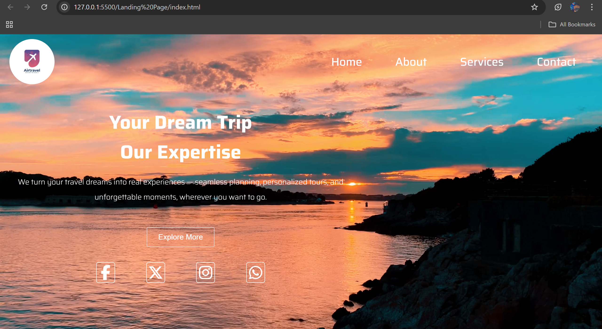

# 🌍 Travel Landing Page

Welcome to the **Travel Landing Page** — a visually stunning, responsive website designed to ignite wanderlust and drive engagement. This landing page serves as a perfect front for a travel agency, tour planner, or personal travel brand.




## ✨ Features

- 🎬 Full-screen background video
- 📱 Fully responsive design
- 🧭 Intuitive navigation bar with toggle menu (mobile friendly)
- 📝 Clean and modern layout with engaging copy
- 🌐 Social media icons for easy outreach
- 🌙 Hover effects and interactive transitions

## 🛠️ Built With

- **HTML5** – Semantic structure
- **CSS3** – Responsive styles, animations, and layout
- **JavaScript** – Menu toggle functionality
- **Font Awesome** – Icons for social media and navigation
- **Google Fonts** – Custom typography (`Saira`)

---

# 🛠 Installation and Setup

To run this project locally, follow these steps:

## 1. Clone the repository
```
git clone https://github.com/your-username/responsive-landing-page.git
```

## 2. Navigate to the project directory
```
cd responsive-landing-page
```

## 3. Open with your preferred browser or code editor

No additional dependencies required. This is a fully static site.


---


# 📂 Folder Structure

```bash
.
├── index.html
├── style.css
├── script.js
└── README.md
```


---

🙋‍♀ Author

Sachin
🔗 [linkedin](https://www.linkedin.com/in/sachin-b8b023372)


---

🤝 Contributing

Pull requests are welcome. For major changes, please open an issue first to discuss your ideas.


---

📄 License

This project is licensed under the MIT License.